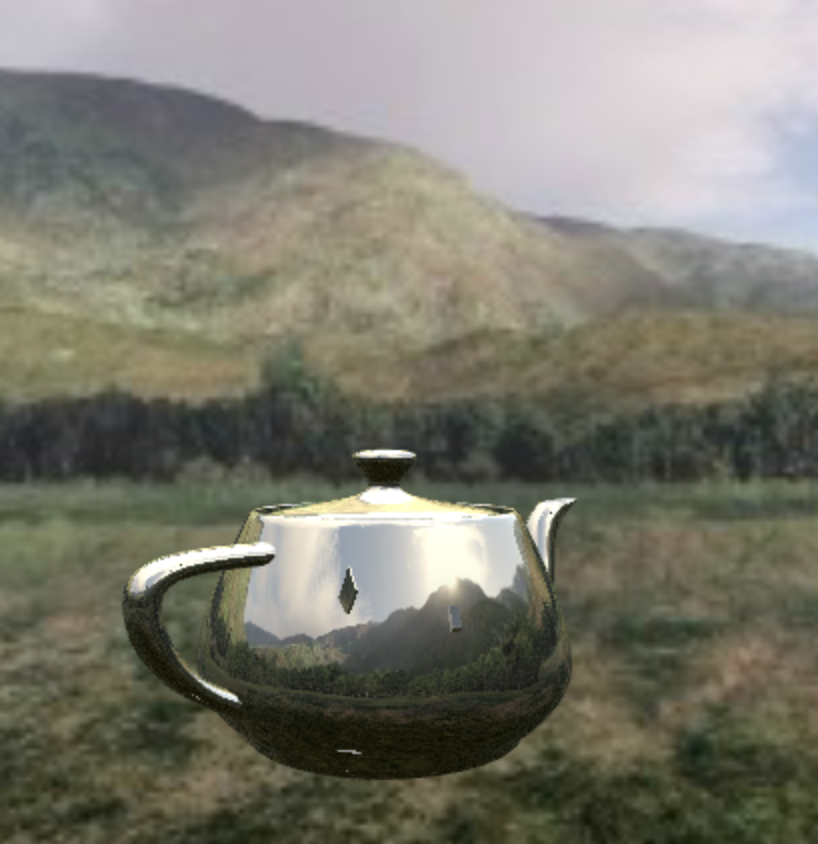

# Examples

This directory contains a collection of Node.js apps which serve examples of what you can
do with phixl and WebGL. You can run `webpack` and `npm start` in these directories to start
the server, and navigate your browser to `http://localhost:4000` to see the examples in action.

The recommended order to view the examples is below along with a brief explanation of each example.

## Cube

This example uses WebGL to render a 3D, rotating cube. It demonstrates how phixl can be used
to render 3D objects and animate a scene.

## Video texture

This example is identical to the cube example above, except instead of an image a video is
used for the texture.

## Edge detection

This example shows how phixl can be used for more than just rendering 3D objects.
Phixl allows you to apply shaders to your webcam video feed to apply visual effects
like edge detection.

## Game of Life

This example shows how you can use phixl to create a GPU-accelerated Conway's
Game of Life. The example renders a board of over 260,000 cells at a ver fast frame rate.
The example shows how you can use phixl to render shaders to textures which can be sampled
in other shaders.

## Ripple effect

This example uses shaders to render a realistic, animated water ripple effect.
This example shows how you can use WebGL shaders and phixl for GPGPU calculations
like solving the 2D wave equation at a fast frame rate.

## Cube camera

This example shows how you can use phixl to render a skybox, do environment
mapping onto a reflective object, and render dynamic relfections using a
cube camera. This example also shows how you can load model data from an OBJ file
and use phixl to render the model.
