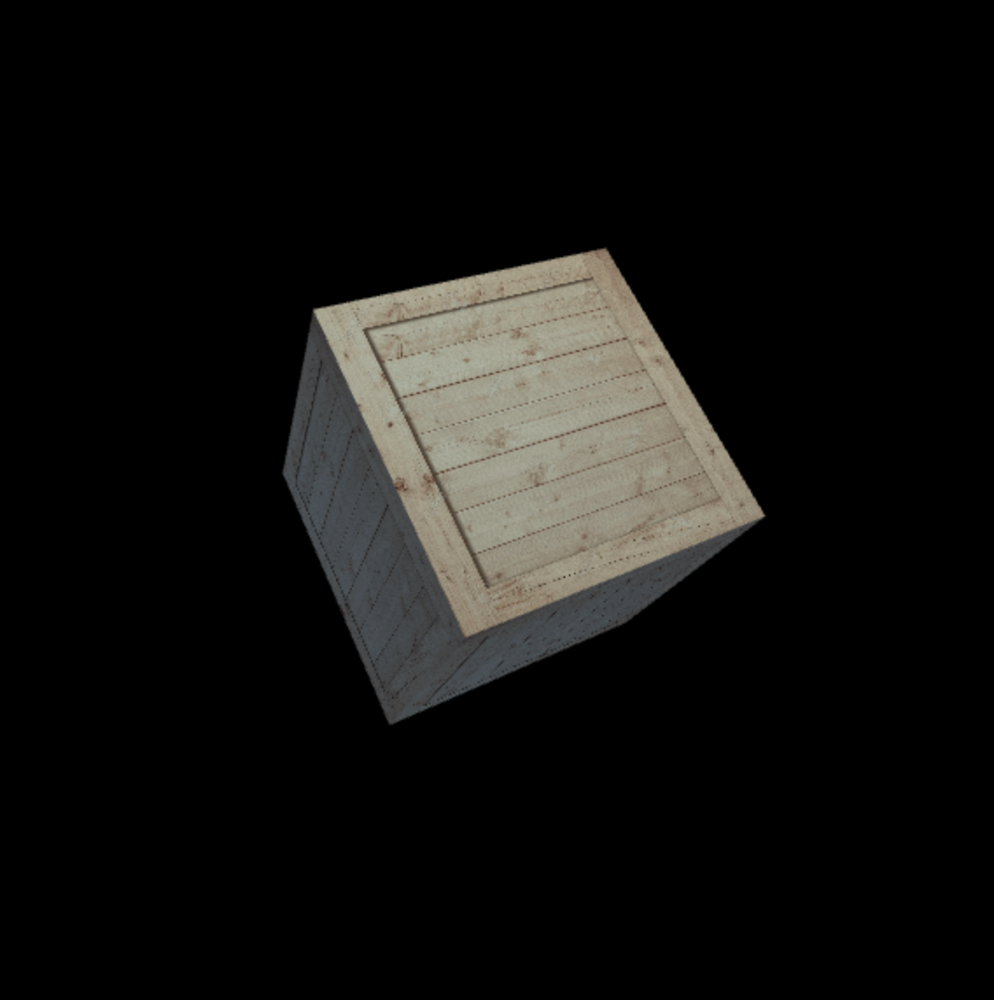

# Cube example

This example shows how you can use phixl to render a 3D cube with WebGL.
The cube is rendered with a Phong lighting model and a 2D texture loaded from an image.

You can see the source code at `src/main.js`.

## Topics covered in this example

### High level concepts

- Rendering a 3D object
- Applying 3D transformations to objects
- Using 2D textures
- Lighting models
- Animating your scene

### Code

- `Shader`
- `Vec2Attribute`
- `Vec3Attribute`
- `ModelMatUniform`
- `ModelMatUniform.rotate`
- `NormalMatUniform`
- `PerspectiveMatUniform`
- `ViewMatUniform`
- `Texture2DUniform`
