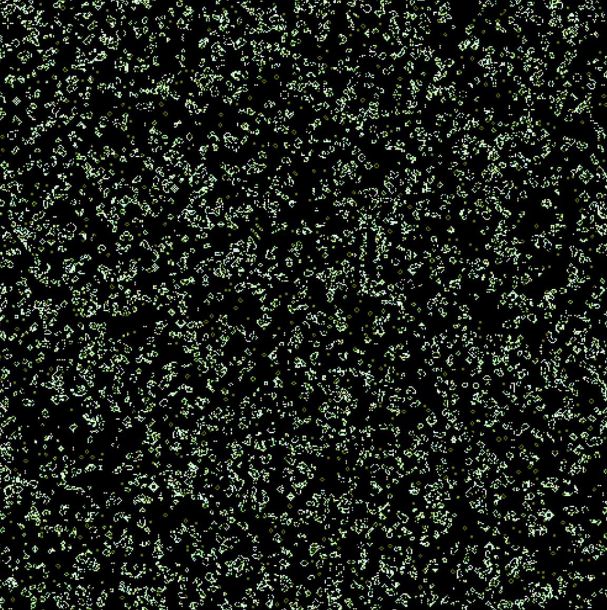

# Game of Life example

This example shows how you can use phixl to render a GPU-accelerated
[Conway's Game of Life](https://en.wikipedia.org/wiki/Conway's_Game_of_Life) animation.
The library renders a 512x512 pixel board (over 260,000 cells!) at a very fast framerate.
This example shows how you can use phixl to take advantage of the computational power of GPUs for many parallel operations.

## Topics covered in this example

### High level topics

- Conway's Game of Life
- Rendering to a texture using framebuffers
- Sampling from another texture to render a texture
- Animating the scene

### Code

- `Shader`
- `Vec2Attribute`
- `Vec2Uniform`
- `Texture2DUniform`
