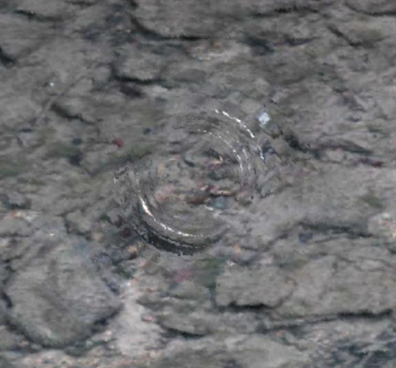

# Ripple effect example

This example shows how you can use phixl to create a water ripple effect.

The water ripple wave is computed by solving the 2D wave equation using a
[discrete Laplace operator](https://en.wikipedia.org/wiki/Discrete_Laplace_operator#Implementation_via_operator_discretization)
and [Verlet integration](https://en.wikipedia.org/wiki/Verlet_integration).
The wave also gets a constant damping so that it dissipates over time.
To reduce noise, a blur kernel is applied.

The wave is rendered to a texture so that it can be sampled in later frames
to compute the next iteration of the wave. The wave texture is also used
to apply a shader to a canvas which uses the ripple effect and Snell's law
to render a realistic looking water effect.

## Topics covered in this example

### High level topics

- Convolutions
- Gaussian blur filter
- Discrete Laplacian filter
- Verlet integration
- Wave equation
- Raytracing
- Snell's Law
- Diffuse and specular lighting
- Rendering to a texture using a framebuffer
- Sampling from a texture
- Animating the scene

### Code

- `BooleanUniform`
- `Shader`
- `Texture2DUniform`
- `Vec2Attribute`
- `Vec2Uniform`
