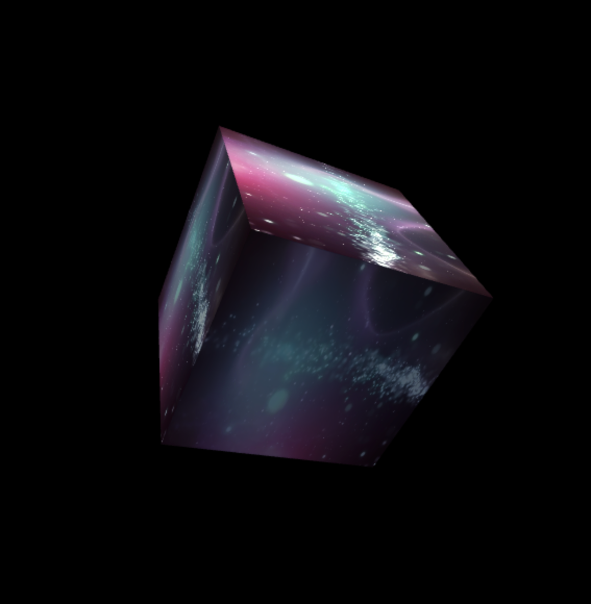

# Video texture example

Like the `cube` example, this example renders a 3D cube using phixl and is meant to demonstrate that the library supports video textures as well.

You can see the source code at `src/main.js`.

## Topics covered in this example

- `Shader`
- `Vec2Attribute`
- `Vec3Attribute`
- `ModelMatUniform`
- `ModelMatUniform.rotate`
- `NormalMatUniform`
- `PerspectiveMatUniform`
- `ViewMatUniform`
- `Texture2DUniform`
